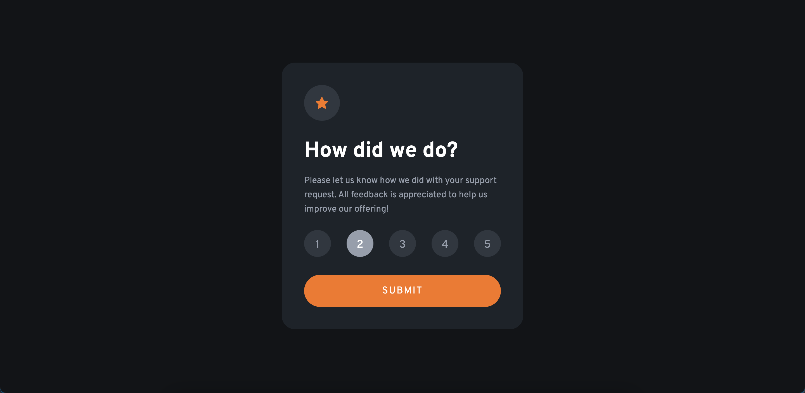

# Frontend Mentor - Interactive rating component solution

This is a solution to the [Interactive rating component challenge on Frontend Mentor](https://www.frontendmentor.io/challenges/interactive-rating-component-koxpeBUmI). Frontend Mentor challenges help you improve your coding skills by building realistic projects. 

## Table of contents

- [Overview](#overview)
  - [The challenge](#the-challenge)
  - [Screenshot](#screenshot)
  - [Links](#links)
- [My process](#my-process)
  - [Built with](#built-with)
  - [What I learned](#what-i-learned)
  - [Continued development](#continued-development)
  - [Useful resources](#useful-resources)
- [Author](#author)
- [Acknowledgments](#acknowledgments)

**Note: Delete this note and update the table of contents based on what sections you keep.**

## Overview

### The challenge

Users should be able to:

- View the optimal layout for the app depending on their device's screen size
- See hover states for all interactive elements on the page
- Select and submit a number rating
- See the "Thank you" card state after submitting a rating

### Screenshot

### Links

- GitHub Files URL: [Add solution URL here](https://github.com/spenceraevans/frontendmentor-ratingcard)
- Live Site URL: [Add live site URL here](https://frontendmentor-ratingcard.vercel.app/)

## My process

### Built with

- HTML
- CSS
- Flexbox
- JavaScript

### What I learned

This was my first project after learning css flexbox so it was fun to get to put what I learned into practice. Also put some of my Javascript knowledge to the test when setting up the rating buttons and rating text on the 'thank you state' part of the project. 

### Continued development

I still plan on learning and getting better at both CSS flexbox and Javascript as a whole. Also learning how to best use media queries when setting up responsive layouts to adjust to smaller screens

### Useful resources

- [StackOverflow Answers](https://stackoverflow.com/questions/42469500/how-to-change-span-style-while-hovering-a-div) - This helped me figure out how to add the hover state correctly to a span that I had within a div that was also changing colors so they would change at the same time even if the span was not directly being touched by the cursor
- [MDN Docs](https://developer.mozilla.org/en-US/docs/Web/CSS/Using_CSS_custom_properties) - This page showed me how to set up my CSS variables for the page colors so I didnt have to type out the rgba values each time a color was needed

## Author

- Frontend Mentor - [@spenceraevans](https://www.frontendmentor.io/profile/spenceraevans)
- Twitter - [@spenceraevans](https://www.twitter.com/spenceraevans)
- Github - [@spenceraevans](https://github.com/spenceraevans)

## Acknowledgments

MRZ.Code.Manufacture on YouTube had a video of this exact challenge and I used some inspiration from this video when setting up my rating buttons as I was struggling at first to design them correctly. 

